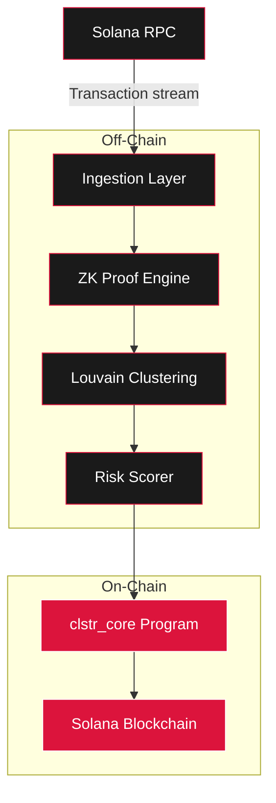

<p align="center">
  
</p>

<h1 align="center">clstr</h1>
<p align="center"><strong>Zero-knowledge wallet cluster analysis on Solana</strong></p>

<p align="center">
  
  
  
  <a href="https://clstr.network">
    
  </a>
  <a href="https://x.com/clstrlabs">
    
  </a>
</p>

---

clstr is a Solana-native wallet clustering protocol that combines on-chain burn-and-flag mechanics with off-chain zero-knowledge proofs and graph analysis. The system monitors wallet behaviors, clusters related addresses using the Louvain algorithm, and publishes tamper-proof risk scores on-chain.

| Component | Description |
|-----------|-------------|
| **clstr_core** | Anchor program handling burn, flag, and score operations |
| **clstr_math** | Louvain clustering and graph utilities in pure Rust |
| **sdk** | TypeScript client for interacting with the on-chain program |
| **cli** | Command-line tool for operators and validators |

---

## Architecture



---

## Features

- On-chain burn-and-flag mechanism via Anchor program
- Zero-knowledge proof generation using SHA-256 commitments
- Louvain community detection for wallet clustering
- Real-time transaction monitoring via Solana RPC webhooks
- TypeScript SDK for seamless dApp integration
- CLI tooling for validators and operators
- Configurable risk thresholds and scoring parameters

---

## Installation

```bash
git clone https://github.com/clstr-labs/clstr.git
cd clstr
```

### Build the Anchor Program

```bash
anchor build
```

### Install SDK Dependencies

```bash
cd sdk
npm install
```

### Build the CLI

```bash
cargo build --release -p clstr-cli
```

---

## Usage

### Flag a Wallet

```typescript
import { ClstrClient } from "./clstr-sdk";

const client = new ClstrClient(program, provider);
await client.flagWallet(targetPubkey, riskScore, zkProofHash);
```

### Run Clustering

```bash
clstr-cli cluster --input transactions.json --output clusters.json
```

### Verify a ZK Proof

```bash
clstr-cli verify --proof proof.json --commitment 0xabc123
```

---

## Configuration

| Variable | Description | Default |
|----------|-------------|---------|
| `SOLANA_RPC_URL` | Solana RPC endpoint for connections and webhooks | - |
| `CLUSTER_RESOLUTION` | Louvain resolution parameter | `1.0` |
| `MIN_RISK_THRESHOLD` | Minimum score to trigger a flag | `0.65` |
| `ZK_HASH_ROUNDS` | Number of SHA-256 iterations | `256` |
| `PROGRAM_ID` | Deployed program address | `E1iTSqt1YkW6LoNXMspEoxsdotzEdmn3QjEJL5R3NUwe` |

---

## Contributing

See [CONTRIBUTING.md](./CONTRIBUTING.md) for guidelines.

---

## License

MIT License. See [LICENSE](./LICENSE) for details.

---

Built on Solana.

<!-- 1385974e -->
