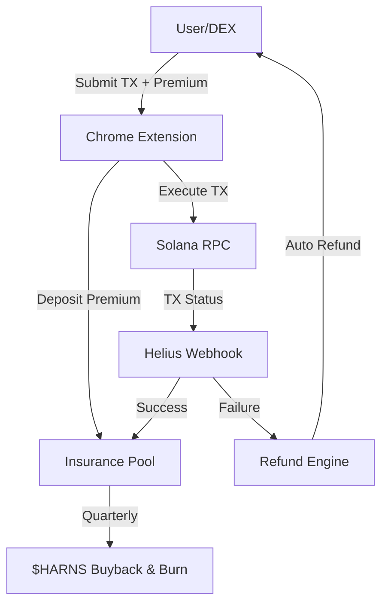

<p align="center">
  
</p>

<p align="center">
  <a href="https://x.com/harns_fun">
    
  </a>
  <a href="https://harns.fun">
    
  </a>
  
  
  
</p>

---

CA: 87dyS1rp82TktwxM6HU22fG3AoWyPncdqr3CAA62pump

TX failure insurance protocol for Solana. Never lose a fee again.

Harns provides escrow-based premium pools with an automatic refund engine. When a transaction fails on-chain, the protocol detects the failure via webhooks and returns the insured premium to the user within seconds.

## Architecture



## Features

| Feature | Description |
|---------|-------------|
| Escrow Pool | Premiums are held in an on-chain PDA-controlled pool |
| Auto Refund | Failed transactions trigger automatic refunds via webhook |
| Rate Engine | Dynamic premium rates adjustable by pool authority |
| Policy TTL | Each policy has a 5-minute time-to-live window |
| Buyback | Quarterly buyback-and-burn of $HARNS from pool profits |

## Project Structure

```
programs/harns/src/
  lib.rs                  -- Program entrypoint and instruction dispatch
  state.rs                -- Account state definitions (InsurancePool, Policy, RefundRecord)
  errors.rs               -- Custom error codes
  events.rs               -- Event structs for logging
  instructions/
    initialize.rs         -- Pool initialization
    deposit_premium.rs    -- Premium deposit and policy creation
    process_refund.rs     -- Refund processing for failed transactions
    update_rates.rs       -- Premium rate updates

sdk/src/
  client.ts               -- HarnsClient class with PDA derivation
  types.ts                -- TypeScript type definitions
  constants.ts            -- Program constants and seeds
```

## Installation

```bash
git clone https://github.com/harns-labs/harns-core.git
cd harns
```

### Build the program

```bash
anchor build
```

### Run SDK tests

```bash
cd sdk
npm install
npm test
```

## Usage

```typescript
import { HarnsClient } from "@harns-labs/sdk";
import { PublicKey } from "@solana/web3.js";
import { BN } from "@coral-xyz/anchor";

const client = new HarnsClient({
  rpcUrl: "https://api.devnet.solana.com",
});

// Derive pool address
const authority = new PublicKey("...");
const [poolAddress] = await client.findPoolAddress(authority, new BN(1));

// Fetch pool state
const pool = await client.getPool(poolAddress);
console.log("Active policies:", pool?.activePolicies);
console.log("Total premiums:", pool?.totalPremiums.toString());

// Calculate premium for a 5000 lamport tx fee at 2.5% rate
const premium = client.calculatePremium(5000, 250);
console.log("Premium:", premium, "lamports");
```

## Token Utility

| Mechanism | Description |
|-----------|-------------|
| Buyback & Burn | Quarterly pool profits used to buy and burn $HARNS |
| Fee Discount | $HARNS holders receive reduced premium rates |
| Governance | Token holders vote on rate adjustments and pool parameters |
| Staking | Stake $HARNS to earn a share of protocol revenue |

## License

MIT
